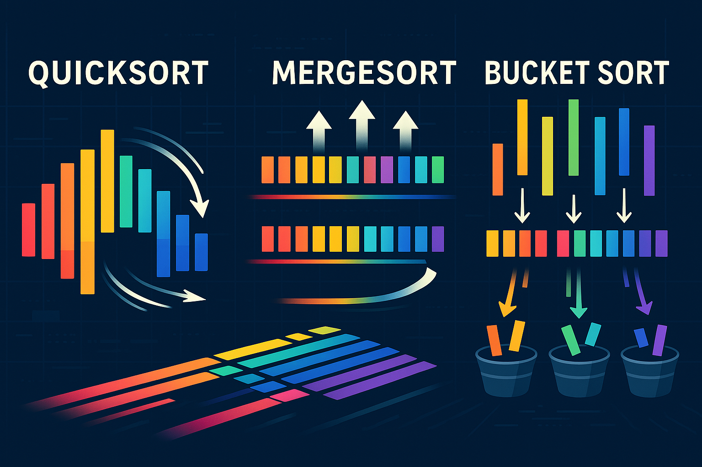

# Sorting algorithms

Implementation of QuickSort, MergeSort and BucketSort sorting algorithms.

**SPECIFICATIONS**

Language: Java

SDK: Oracle OpenJDK version 18.0.2

IDE used: IntelliJ IDEA 2022.2 (Ultimate Edition)

**INSTRUCTIONS**

When running the program through IntelliJ, a menu will be displayed asking which dataset you want to load. Once selected, this dataset will be used for the rest of the program for all algorithms (so if you want to switch datasets, you need to stop the execution and run it again).

Immediately afterward, another menu will appear asking you to choose which functionality you want to execute. The options in this menu are:

1) **Sort vessels by age**: Sorts the vessels from newest to oldest using quickSort
2) **Sort vessels by name**: Sorts the vessels alphabetically using mergeSort
3) **Sort vessels by capabilities**: Sorts the vessels based on one of their attributes, using bucketSort
4) **Exit**: Ends the execution of the program

Each time you select an option other than 4, the ordered list of vessels and their attributes will be printed on the screen. Immediately after, this menu will be displayed again (and so on cyclically until option 4 to exit is chosen).

**IMPORTANT**: Datasets are only loaded once at the beginning of the program, and all lists are passed by reference. This means that once a list is sorted according to a sorting criterion, it remains sorted in that way indefinitely. Therefore, if you want to consider the "execution time" displayed for an algorithm, you should only consider whether it is the first time that algorithm is executed or if another algorithm has been executed before (as the list will already be sorted and the execution time will be much lower).

# Authors
[Pol Valero] (https://github.com/pol-valero)

[Alex Liu] (https://github.com/Alello23)